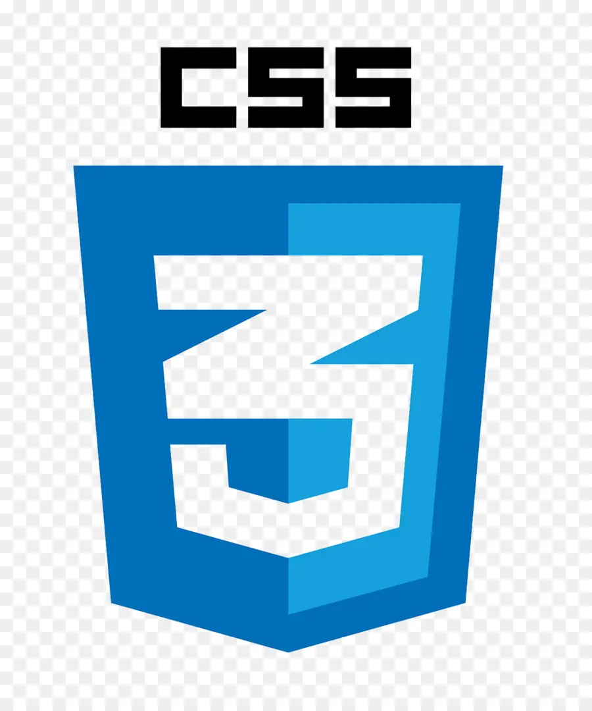
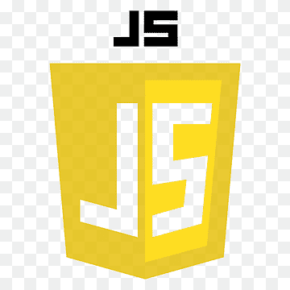

<h1>Jogo do número secreto<h1>

<h2>    Sobre<h2>

Projeto de estudo curso de lógica de programação da Alura.

<<<<<<< HEAD
cssico.png</img>htmlico.png</img>JSico.png</img>
=======
Usando:   
>>>>>>> parent of bffabd7 (aprendendo a usar imagens no readme bymyself)
